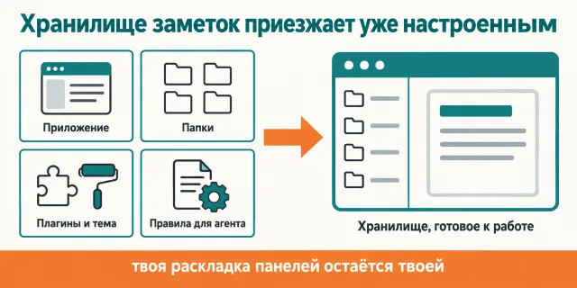
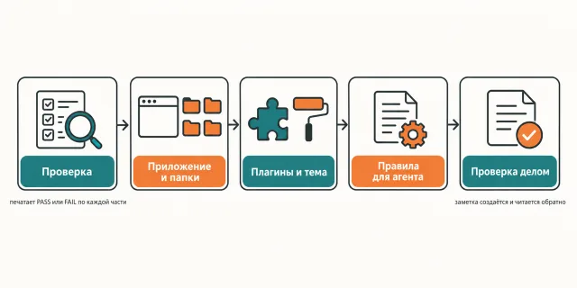

English · [Русский](README.md)

# Obsidian installs in an evening and gets configured for half a year — and still is not right

This plugin moves a working Obsidian onto your Mac whole: the app, the vault folders, the
`.obsidian` configuration with every plugin and the theme, the Obsidian skills for Claude Code,
and a `CLAUDE.md` the agent reads to know where notes belong.

```
claude plugin marketplace add https://github.com/beCyborg/jadlis-hub
claude plugin install jadlis-obsidian@jadlis --config VAULT_PATH=~/Jadlis
```

This is the second step of the Jadlis route. The first is setting up Claude Code itself,
the third is voice.



In words: on the left four pieces — the app, the folders, the plugins with the theme and the rules
for the agent — on the right a ready vault where your pane layout stays yours.

This is my own workplace published as it is, not a product: what I stopped using, I removed.

## Before → after

| By hand | With an AI chat | With this plugin |
|---|---|---|
| **How the plugin set comes together.** You open Community plugins, read descriptions, install at random, and remove half of them later. | You ask "which plugins should I install" and get a list from articles, part of it abandoned. | Exactly the 12 I use every day arrive as ready builds with their settings — including the theme knobs, without which Border does not look right. |
| **How settings get carried over.** You copy the whole `.obsidian` and drag along someone else's paths, bookmarks and pane layout. | A chat does not carry settings over — it retells them. | The export follows the plugin list strictly, paths and personal data are stripped, and the recipient's `workspace.json` is not touched at all. |
| **How Restricted mode gets turned off.** You hunt for the toggle in settings and wonder why the plugins stay silent. | It explains where the toggle is, and that is all. | It is turned off by a CLI command, and the same command then shows: 12 plugins enabled, theme Border, no errors. |
| **How it connects to the agent.** The agent sees the folder as ordinary files and drops notes anywhere. | You explain from scratch every time that this is Obsidian and what lives where. | The vault gets a `CLAUDE.md` with the conventions and a `.claude/rules/vault-cli.md` with the search pitfalls; the Obsidian skills bundle and `obsidian-cli` get installed. |
| **How you know it all landed.** You look at the screen and hope. | Ask and it answers "it should work". | Claude creates a note through the CLI and reads it back, and you check the hotkey with your fingers: select a word, press ⌘⇧H. |

## How it works



Going in — a Mac and the path the vault will live at.
Inside — the check prints PASS/FAIL, only the missing parts are acted on, and the previous
configuration goes into a backup.
Coming out — a vault in which the agent knows where notes belong.

In words: check → app and folders → plugins and theme → rules for the agent → a check that does
something.

What arrives on your Mac:

| What | Exactly what |
|---|---|
| **The app** | Obsidian from Homebrew, if it is not in `/Applications` yet. |
| **The Sync subscription** | the link and why it matters; you buy it yourself, the price is on the page. |
| **Vault folders** | `Входящие`, `Файлы`, `Знания`, `Система/Планы` — four of them, no methodology. |
| **Obsidian settings** | `app.json`, `appearance.json`, `core-plugins.json`: a new note goes to `Входящие`, an attachment to `Файлы`, the default mode is reading. |
| **12 plugins** | Style Settings (theme knobs), Advanced Canvas (diagrams), Daily notes calendar (calendar of day notes), Folder notes (a cover note for a folder), Periodic Notes (day, week, month, quarter), My SVGs (your own icons), Iconic (folder icons and colours), Linter (auto-format on save), Dragger (dragging blocks), Sidebar Highlights (highlights in the panel), Editing Toolbar (a formatting bar), Flexplorer (sorting and hiding in the file explorer). |
| **Theme and snippet** | the Border theme with its saved colours plus the `hide-files` CSS snippet. |
| **Hotkeys** | the owner's bindings, ⌘⇧H for a highlight included; hotkeys of plugins that are not shipped are stripped. |
| **CLI** | `obsidian-cli` from inside the app and a `~/bin/obsidian` symlink — Claude reads and writes notes from the terminal. |
| **Obsidian skills** | the `obsidian@obsidian-skills` bundle by kepano: `obsidian-cli`, `obsidian-markdown`, `obsidian-bases`, `json-canvas`. |
| **`CLAUDE.md` in the vault** | what this folder is, where things go, the Obsidian markup conventions, clickable links to notes from the terminal. |

The skill walks nine steps, one per turn, and says what it will do before each one.

1. **Probe.** `scripts/probe.sh` prints `key=PASS|FAIL|SKIP` for every part of the bundle;
   only the `FAIL` ones are worked on.
2. **What to buy.** Sync, the link, why it matters. No need to wait for the payment.
3. **The app.** `brew install --cask obsidian`, if it is missing.
4. **Folders and `CLAUDE.md`.** Four folders plus `CLAUDE.md`, `.claude/rules/vault-cli.md`
   and `.claude/settings.json`. A file that already exists and differs gets a `.jadlis-new`
   copy alongside and a `diff` shown.
5. **The `.obsidian` configuration.** First a dry run listing the files, then the question,
   then the copy with the previous folder backed up.
6. **Open the vault and turn Restricted mode off.** A running Obsidian takes the folder over
   IPC, no clicking. Then the CLI turns Restricted mode off and checks: 12 plugins enabled,
   theme Border, no errors.
7. **Sync.** Signing in happens only in the Obsidian interface.
8. **Bundle and CLI.** `obsidian@obsidian-skills` and the `~/bin/obsidian` symlink.
9. **A check that does something.** Claude creates a note in `Входящие` through the CLI
   and reads it back.

Plugin settings arrive wherever there were no foreign paths inside. Four plugins have their
paths stripped, two ship no settings at all — the plugin takes its own default. The breakdown
per plugin is in `skills/obsidian/references/plugins.md`.

The bundle can be rebuilt from a live configuration with `tools/export-obsidian.py`: it reads
`.obsidian`, strips paths and personal data, and exits 1 if anything leaked through.

## Installing and the first run

You need macOS with Homebrew — the app installs with `brew install --cask obsidian`.
You also need Claude Code installed and `jq` for the checks.

**a) Text to paste to the agent.** Copy it whole into the Claude Code chat:

```
You are an installer. Install the jadlis-obsidian plugin from the jadlis marketplace
on this Mac. This plugin needs no keys and no secrets.
First ask me where the vault folder should be and substitute it for ~/Jadlis
in the second command.
Run exactly these commands, verbatim, without shortening anything:
1. claude plugin marketplace add https://github.com/beCyborg/jadlis-hub
2. claude plugin install jadlis-obsidian@jadlis --config VAULT_PATH=~/Jadlis
3. claude plugin list — show me the jadlis-obsidian line and its version.
Then tell me in one line: restart Claude Code and type /obsidian.
Show me each command in full before running it and wait for a "yes".
```

**b) The commands by hand.**

```
claude plugin marketplace add https://github.com/beCyborg/jadlis-hub
claude plugin install jadlis-obsidian@jadlis --config VAULT_PATH=~/Jadlis
claude plugin list
```

The first command installs nothing — it adds the marketplace. Only the second installs, and it is
removed by one line: `claude plugin uninstall jadlis-obsidian@jadlis --keep-data`. The vault path
is set at install time through `VAULT_PATH`; leave it out and `~/Jadlis` is used.

**c) The short command.** Restart Claude Code and type:

```
/obsidian
/obsidian статус
```

Not found — check the name with `claude plugin list`. `/obsidian` and the full form
`/jadlis-obsidian:obsidian` are the same thing; `статус` only shows what is already set up and
changes nothing.

## Limits, cost, updates

**What it does not touch.** `workspace.json` and `workspace-mobile.json` — your tabs and pane
layout stay yours. An existing `CLAUDE.md`, `.claude/settings.json` or `.obsidian` is never
overwritten without an explicit "yes"; the previous configuration goes into a dated backup next
to the vault. Notes are not read and are not sent anywhere. The subscription is not bought for you.
From my configuration, bookmarks, the graph, Sync and Publish data, the icon folder, and the
settings of plugins that had paths to my notes inside did not travel here.

**What costs money.** Only **Obsidian Sync** (<https://obsidian.md/sync>): notes on the phone and
a backup with version history. The app itself is free, and so is everything else in this plugin.
Without Sync all nine steps still complete; the notes simply stay on one machine.
There is no semantic search over notes here — it lives separately and is not part of this bundle.

**How tokens get spent.** A run is light: there are no subagents and no fan-outs, the work is
shell scripts and questions to the human. The most expensive part is reading a `diff` when an
existing `CLAUDE.md` gets in the way.

**Verified where I work:** my Mac, my subscription, Obsidian 1.13.7. macOS only: the bundle leans
on Homebrew and on the app living in `/Applications`; I have tested no other system.

**Terms of use.** There is no license: all rights reserved by the author. You may read it and
use it personally. Commercial use, republishing and bundling it into your own products —
by arrangement with me.

**Third-party code.** `assets/obsidian/plugins/` and `assets/obsidian/themes/` hold unmodified
builds of community Obsidian plugins and of the Border theme. They stay under their own licenses
and with their own authors: Advanced Canvas (Developer-Mike), Daily notes calendar (bartkessels),
Dragger (Ariestar), Editing Toolbar (Cuman), Flexplorer (kh4f), Folder notes (Lost Paul),
Iconic (Holo), My SVGs (Omar Badawy), Linter (Victor Tao), Style Settings (mgmeyers),
Periodic Notes (Liam Cain), Sidebar Highlights (trevware), Border theme (Akifyss).
Each one's license and repository address are in its `manifest.json`; license files travel with
the build whenever the author ships them. The `obsidian-skills` bundle is installed from the
kepano marketplace and lives by its own rules.

**Updating.** Auto-update for a third-party marketplace is off on your side: until you run the
first command, you keep the version you installed.

```
claude plugin marketplace update jadlis
claude plugin update jadlis-obsidian@jadlis
claude plugin list
```

Reinstalling, if something landed crooked:

```
claude plugin uninstall jadlis-obsidian@jadlis --keep-data && claude plugin install jadlis-obsidian@jadlis
```
